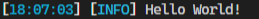

# LoggingLib

npm:

```npm
npm install @tymianekpl/logginglib --save
```

yarn:

```yarn
yarn add @tymianekpl/logginglib
```

## This is a library created to help with logging.

### Sample code:

```js
import LoggingLib from "@tymianekpl/LoggingLib"

const logger = new LoggingLib({
     category: "Main",
});
logger.info("Hello world!");
```

> Output: \
> 
